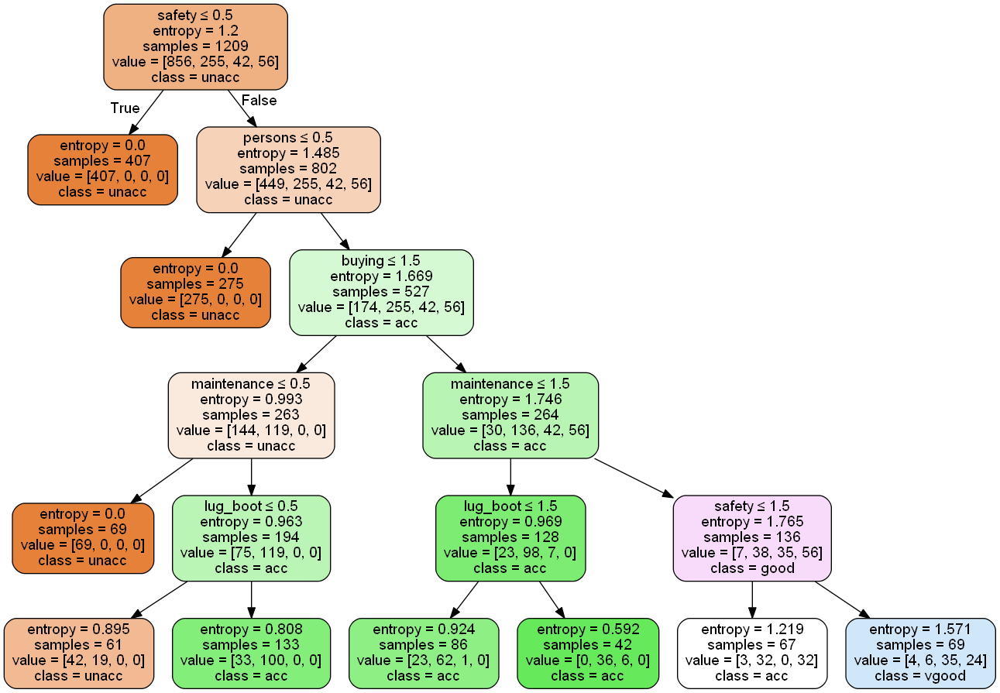

<h2 align="center">
        
<a href="https://drive.google.com/file/d/1lTGX7qvQADMDAtfkQ9LmwxCcLONXS2Ca/view?usp=sharing">
         
</a>
 
 
<a href="">
         
</a>
       <a href="https://www.linkedin.com/in/matheusfbonfim/">
         
       </a>     
</h2>


<h1 align="center">
    
</h1>

<h1 align="center">
   Aprendizado Supervisionado - Árvore de decisão
<h2 align="center">
   Car Evaluation - Data Set
</h2>
</h1>

<!--INDEX-->
<p align="center">
  <a href="#-sobre-o-projeto">Sobre o projeto</a>&nbsp;&nbsp;&nbsp;|&nbsp;&nbsp;&nbsp;
  <a href="#-Desenvolvimento">Desenvolvimento</a>&nbsp;&nbsp;&nbsp;|&nbsp;&nbsp;&nbsp;
  <a href="#-árvore-de-decisão">Árvore de decisão</a>&nbsp;&nbsp;&nbsp;|&nbsp;&nbsp;&nbsp;
  <a href="#rocket-tecnologias">Tecnologias</a>&nbsp;&nbsp;&nbsp;|&nbsp;&nbsp;&nbsp;
  <a href="#-tools">Tools</a>&nbsp;&nbsp;&nbsp;|&nbsp;&nbsp;&nbsp;
  <a href="#-como-executar-o-projeto">Como executar o projeto</a>&nbsp;&nbsp;&nbsp;|&nbsp;&nbsp;&nbsp;
  <a href="#memo-license">License</a>
</p>


## 💻 Sobre o projeto

- A proposta do presente trabalho tem como objetivo demonstrar a aplicação de um metódo de aprendizado supervisionado com a técnica de  ́arvore de decisão, utilizando a
base de dados Car Evaluation, no qual contém informações de atributos de um carro e contribui para o prognóstico da qualidade de um veículo.


## 🔖 Desenvolvimento

No link abaixo do **Google Drive** é possível baixar um relatório no qual foi desenvolvido com objetivo de descrever sobre o desenvolvimento da implementacão da árvore de decisão sobre esta base de dados, assim como demonstrar os resultados e discussões obtidos e por fim uma conclusão:

[](https://drive.google.com/file/d/1lTGX7qvQADMDAtfkQ9LmwxCcLONXS2Ca/view?usp=sharing)

## 🌲 Árvore de decisão

<h1 align="center">
    
</h1>


## :rocket: Tecnologias

This project was developed with the following technologies:

- [scikit-learn](https://scikit-learn.org/stable/)
- [pandas](https://pandas.pydata.org/)
- [numpy](https://numpy.org/)

## ⛏ Tools
- [Visual Studio Code](https://code.visualstudio.com/)

## 🚀 Como executar o projeto

   ```
   - Clone this repository:
   $ git clone https://github.com/matheusfbonfim/happy

   - Enter in directory:
   $ cd happy

   - Execute application:
   $ python main.py
   ```

## :memo: License

O projeto está sobre a licença [MIT](./LICENSE) ❤️ 

Gostou? Deixe uma estrelinha para ajudar o projeto ⭐

<!-- Mensagem final -->
<h3 align="center">
Feito com ❤️ por <a href="https://www.linkedin.com/in/matheusfbonfim/">Matheus Bonfim</a>
<br><br>
</h3>


